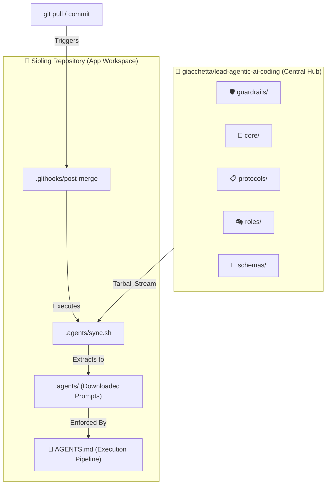

# 🤖 Lead Agentic AI Coding

> Centralized, agent-agnostic prompt hub & rule engine for modern AI coding assistants (*Claude Code, GitHub Copilot, OpenClaw, Hermes, etc.*).

---

## 📐 System Architecture



---

## 📂 Hub Structure

| Directory | Purpose | Primary Directives |
| :--- | :--- | :--- |
| 🛡️ **`guardrails/`** | **Non-Negotiables** | Prevent secret leaks, destructive CLI commands, and unauthorized `.env` edits. |
| 🎯 **`core/`** | **Quality Standards** | Enforce SOLID/DRY principles, strict typing, linting, and token efficiency. |
| 📋 **`protocols/`** | **Maintenance Rules** | Dictate *when* agents must update `AGENTS.md`, keep `README.md` visual, and keep multi-issue PR scope honest. |
| 🎭 **`roles/`** | **Personas** | Behavioral prompts for System Architect and Code Reviewer tasks. |
| 📐 **`schemas/`** | **Structured Outputs** | JSON schemas for standardizing PR summaries and architecture logs. |

---

## 🧭 Adding a New Protocol

A protocol file under `protocols/` is only *consulted* until something makes it
*mandatory*. If a new protocol must always be read under some condition — not just
exist as reference material — that condition becomes a numbered `STEP N` entry in the
`AGENTS.md` execution sequence. A protocol file with no execution-sequence step is
inert: it syncs into `.agents/protocols/` but nothing ever reads it.

Adding that `STEP N` line is **two edits, in the same change**, never one:

1. **`AGENTS.md` in [`lead-agentic-ai-template`](https://github.com/giacchetta/lead-agentic-ai-template)** —
   the seed every new sibling repo scaffolds its `AGENTS.md` from. Skip this and every
   repo created after the protocol lands starts without the trigger.
2. **Every existing sibling repo's own `AGENTS.md`**, by hand, one repo at a time.
   This hub has no mechanism to push into an already-scaffolded, repo-local
   `AGENTS.md` — it's explicitly local and hand-maintained (see the "AGENTS.md
   Maintenance" protocol), never synced. Re-running `.agents/sync.sh` only updates the
   *content* a step points at (the protocol file itself); it does not add the step.

A protocol that's reference-only (consulted when relevant, never unconditionally
required) needs neither edit — only protocols with a real "you MUST read this when X"
trigger earn a step.

---

## ⚡ Connecting Sibling Repositories

### 1. One-Time Local Machine Setup
Tell Git to use tracked `.githooks/` folders globally across your machine:
```bash
git config --global core.hooksPath .githooks
```

### 2. Manual Prompt Sync
Inside any sibling repository, execute the sync script at any time to pull the latest rules from `main`:
```bash
./.agents/sync.sh
```

---

## 🛑 Execution Sequence for AI Agents

All AI agents operating in sibling workspaces **must** follow the rigid execution chain defined in their local `AGENTS.md`:

```text
1. GUARDRAILS CHECK  --> Read .agents/guardrails/*.md
2. CORE RULES        --> Read .agents/core/*.md
3. READ BLUEPRINT    --> Read Section 2 of local AGENTS.md (No recursive exploration)
4. EXECUTE TASK      --> Complete task following constraints
5. POST-CHECK        --> Update local AGENTS.md if system architecture changed
```